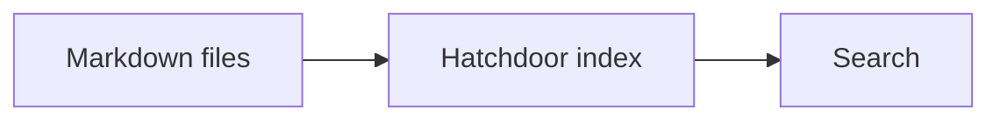

# Supported Markdown reference

A dictionary of the Markdown features Hatchdoor renders. Every note in a Vault is a plain `.md` file — this page shows what that file can contain and how Hatchdoor displays it.

## Inline formatting

Plain text can include **bold**, *italic*, ***bold italic***, ~~strikethrough~~, `inline code`, and links such as <https://example.com>.

Raw HTML is not part of the supported Markdown contract. Keep notes portable by using Markdown syntax where possible.

## Headings

`#` through `######` produce heading levels 1 through 6. Headings receive generated IDs, which is what makes a heading wikilink (below) and the table of contents work.

## Lists

Unordered lists (`-`), ordered lists (`1.`), and nested lists at any depth are all supported. Task lists use `- [x]` (done) and `- [ ]` (open).

## Tables

```markdown
| Feature | Markdown trigger |
| --- | --- |
| Wikilink | `[[Note]]` |
| Callout | `> [!note]` |
```

Tables scroll horizontally on small screens rather than breaking layout.

## Blockquotes and callouts

A plain blockquote (`>`) is an ordinary quoted excerpt. A callout is a blockquote whose first line is `[!type]`, optionally followed by a custom title:

```markdown
> [!note]
> A note callout for neutral information.

> [!warning] Read this first
> A warning callout with a custom title.
```

Supported types: `note`, `info`, `tip`, `warning`, `danger`, `success`, `question`, `example`, `summary`, `abstract`, and likely others — the type controls the icon and color, not the rendering mechanism. Add `+` after the type to make it collapsible and start open, or `-` to start closed: `> [!summary]+`.

## Code blocks

Fenced code blocks (` ``` `) render with syntax highlighting when a language is given (` ```rust `, ` ```bash `, ` ```json `, and so on) and as a plain block when it's omitted.

## Mermaid diagrams

A fenced block with the `mermaid` language renders as a diagram instead of code:

````markdown

````

## Math

Inline math uses single `$...$`; block math uses `$$...$$` on its own lines. Both render with KaTeX.

## Images and PDFs

Local Markdown image syntax works as expected:

```markdown

```

Store an image near the note that references it, and use safe filenames — lowercase ASCII letters, numbers, and hyphens. A Markdown link to a local PDF is marked as a document and opens in a new tab: `[Open the report](report.pdf)`. The same attachment can instead be embedded inline, with page controls, using Obsidian's embed syntax: `![[report.pdf]]`.

## Wikilinks

Hatchdoor resolves `[[Note Title]]` to another note in the same Vault, and refreshes those links whenever Markdown changes. Five forms:

- Plain: `[[Connect your agent]]` → [[Connect your agent]]
- Aliased: `[[Connect your agent|connect an agent]]` — displays custom text
- Aliased inside a table cell: `[[Connect your agent\|connect an agent]]`. A bare `|` would end the cell, so the alias pipe is written escaped. Hatchdoor reads that backslash as syntax rather than as part of the note's name, so the link resolves, shows up in backlinks, and is rewritten by a rename like any other.
- Heading-scoped: `[[Connect your agent#Configure your MCP client]]` — links straight to a heading
- A wikilink to a note that doesn't exist yet still renders — it just has nowhere to go until that note is created: `[[This Note Does Not Exist Yet]]`

## Horizontal rule

Three hyphens (`---`) on their own line renders a horizontal rule, useful for dividing a long note into sections. (It's also frontmatter's delimiter — see below — so this only renders as a rule when it isn't at the very top of the file.)

## Frontmatter

A note may open with a YAML frontmatter block:

```yaml
---
tags: [type/reference]
status: current
---
```

Hatchdoor parses frontmatter and can show properties (tags, aliases, and arbitrary key/value pairs) separately from the note body, without them cluttering the rendered text.

## Tags

A note's tags come from two places. Anything listed under `tags:` in frontmatter counts, in whatever shape you write it, including plain words and numbers.

In the body, only a namespaced hashtag counts: `#area/health` and `#type/reference/draft` are tags, a bare `#todo` or `#1177` is not. The namespace requirement is what keeps ordinary prose, issue numbers, and headings out of your tag list.

Hashtags inside code are never tags, so a note that documents a tag convention does not get filed under it. That covers both a fenced block and an inline span written with backticks:

````markdown
```
#not/a-tag
```

Write it as `#not/a-tag` in your note.
````

---

Related: [[MCP tools reference]] · [[HTTP API reference]]
