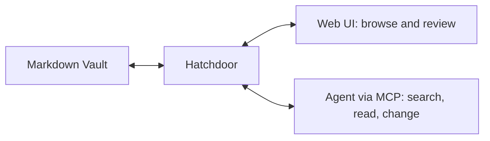

# Hatchdoor documentation

Hatchdoor is an agent-first notes app for Markdown Vaults you own. Connect an agent to search and change notes through Hatchdoor's guarded tools, then use the Web UI to read and review the same files. Markdown stays authoritative; Hatchdoor supplies the operational layer around it.

> [!tip]
> Start an agent read-only. It should search before it reads, read before it changes, and use the current note version when it saves.

## Start here

Follow [[Welcome to Hatchdoor]] to deploy Hatchdoor, connect your own agent, make one deliberate change, and review it in the browser. These docs target Hatchdoor v2.6.0.

Want to look before you install anything? The [public demo](https://hatchdoor.battercloud.cc) is a live, read-only Hatchdoor with four example Vaults in it. It is the same application these docs describe, running the same version.

## Before you start: what kind of notes app is this

Hatchdoor is built for keeping a [[The Second Brain method (external reference)|second brain]] — a durable, external place for the things worth keeping — with one difference from most tools built for that: an MCP-connected agent can read and act on it too, not just you. See [[Why keep a second brain]] for what that changes about the ordinary capture-organize-distill-express rhythm.

That still leaves how to lay out a Vault. Hatchdoor doesn't require any particular layout — pick whichever of these fits how you think, or mix them:

| Method | What it optimizes | Reference | See it live |
| --- | --- | --- | --- |
| **PARA** | Folders by how actionable a note is (Projects, Areas, Resources, Archives) | [[The PARA method (external reference)]] | [Home & Life](https://hatchdoor.battercloud.cc/v/919a41eb-a699-4d46-9857-eaa6db0a85c4/n/readme) |
| **Zettelkasten** | Dense links between atomic notes, little to no folder hierarchy | [[The Zettelkasten method (external reference)]] | [Reading Notes](https://hatchdoor.battercloud.cc/v/7b6b865f-e5fa-4abd-8d1d-d5e75a7341f9/n/readme) |
| **LLM wiki** | An agent that builds and maintains an interlinked wiki for you | [[The LLM wiki pattern (external reference)]] | [Research Wiki](https://hatchdoor.battercloud.cc/v/e1f02552-5a8a-4a5e-9b75-4e40dd1cf141/n/readme) |

The [public demo](https://hatchdoor.battercloud.cc) runs those three side by side, plus a fourth Vault, [Team Docs](https://hatchdoor.battercloud.cc/v/ec49f950-6979-42e3-b31e-e1654e7716c5/n/readme), which uses no folder convention at all and leans on tags and search instead. Every note in them is fictional and the whole instance is read-only, so there is nothing there to break.

They aren't mutually exclusive — see [[How to run an LLM wiki in Hatchdoor]] for one way to combine an LLM wiki with folder-based organization underneath it.

## Documentation areas

| Area | Purpose |
| --- | --- |
| **Get started** | Your first working Vault, agent, and browser session |
| **Guides** | Repeatable operational tasks |
| **Reference** | Configuration and API details |
| **Concepts** | How Hatchdoor stores, indexes, and protects notes |

Guides, Reference, and Concepts will grow from this starting point.

**Guides**

- [[How to deploy Hatchdoor with an agent]]
- [[How to set up a Git-backed Vault]]
- [[How to manage multiple Vaults]]
- [[How to organize a Vault with layers]]
- [[How to run an LLM wiki in Hatchdoor]]
- [[How to import and work with attachments]]
- [[How to edit notes with the live editor]]
- [[How to troubleshoot common problems]]

**Reference**

- [[HTTP API reference]]
- [[MCP tools reference]]
- [[Supported Markdown reference]]
- [[Settings and environment variables reference]]
- [[The LLM wiki pattern (external reference)]]
- [[The PARA method (external reference)]]
- [[The Second Brain method (external reference)]]
- [[The Zettelkasten method (external reference)]]

**Concepts**

- [[What Hatchdoor is]]
- [[The layer system]]
- [[How indexing and search work]]
- [[The security model]]
- [[Vault lifecycle states]]
- [[Why keep a second brain]]
